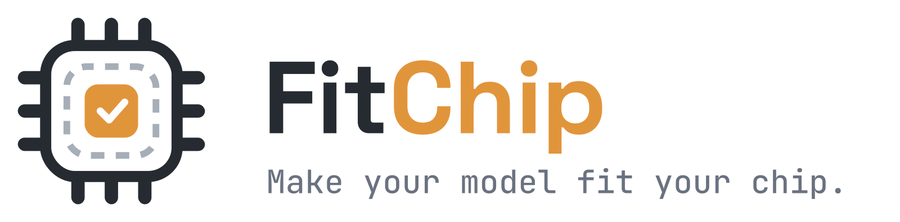

<div align="center">



---

*FitChip is an **Orchestrator, not another ML compiler**. Its core design goal:
any ML compiler (TVM, ONNX Runtime, TensorRT, ExecuTorch…) and any target
(ESP32, STM32, Jetson, x86…) can be plugged in later **without touching the
core**.*

No Python expertise. No tensor wizardry. No vendor lock-in.

[](LICENSE)

[Quick Start](#-quick-start) · [How It Works](#-how-it-works) · [Supported Hardware](#-supported-hardware--backends) · [Roadmap](#️-roadmap)

</div>

---

## The Problem

A trained model has to cross a wall between two worlds — and everyone
standing near that wall gets hurt.

**If you're an embedded engineer**, someone hands you a model and says *"put
this on the ESP32."* What follows is usually **1–3 weeks** of pain: converting
between formats, fighting quantization tooling, discovering unsupported
operators one crash at a time, guessing the tensor arena size, and hand-writing
interpreter boilerplate — all in a Python/ML toolchain you never asked to learn.

**If you're an ML engineer or researcher**, you have the opposite problem: the
model is yours, but the chip isn't. Answering even the basic question — *"will
my model fit and run on this board?"* — means learning ESP-IDF, CMake,
cross-compilation, and C++ interpreter APIs, just to get one number back.

**And before either of you writes a single line**, there's a choice nobody
prepared you for: *which* compiler? TensorFlow Lite Micro, ExecuTorch, TVM,
ONNX Runtime, a vendor SDK? Each one supports a different set of operators,
formats, quantization schemes, and boards — and the only way to find out you
picked wrong is to lose a week finding out the hard way.

Either way, the same weeks are lost to glue work and trial-and-error that
have nothing to do with your actual job.

## The Solution

FitChip is not another ML compiler — it's the layer that makes the existing
ones usable. Every industry-standard compiler (TensorFlow Lite Micro,
ExecuTorch, Apache TVM, and more) sits behind **one consistent interface**,
and FitChip does the tedious parts for you:

- **It picks the right compiler for you.** The Selection Engine matches your
  model's operators and format against your board's real constraints — RAM,
  flash, ISA, accelerators — and routes the job to the backend that can
  actually handle it. No week-long bake-offs.
- **It tells you *before* you flash.** `fitchip inspect` reports operator
  compatibility and estimated arena/flash footprint in seconds — no board, no
  toolchain, no compile. If the model won't fit, you find out now, not after
  a crash on hardware.
- **It hands you a finished project, not a puzzle.** One command turns
  `.tflite` / `.onnx` into a complete, buildable ESP-IDF or PlatformIO
  project — model as a C array, interpreter setup, build files, README.

```bash
pip install fitchip

fitchip compile model.tflite --target esp32s3 --quantize int8
```

```text
✔ Model parsed            42 ops, 3.2 MB (float32)
✔ Backend selected        TFLM + esp-nn  (42/42 ops · best fit for esp32s3)
✔ Quantization (INT8)     3.2 MB → 0.86 MB  (−73.1%)
✔ Memory estimate         arena ≈ 187 KB · flash ≈ 1.1 MB · fits ESP32-S3 ✓
✔ Project generated       ./out/esp32s3-project/  (ESP-IDF + PlatformIO)

Next:  cd out/esp32s3-project && idf.py flash monitor
```

The output is a **complete, buildable firmware project** — plain C/C++ you can
read, diff, and audit. Open it, flash it, ship it. And when a compiler stops
being maintained or a better one appears, you switch backends with a flag —
your workflow doesn't change.

## ✨ Features

- **One-command compile** — from `.tflite` / `.onnx` to a ready-to-flash ESP-IDF or PlatformIO project.
- **Operator compatibility check, *before* you flash** — know exactly which ops your target can't run, with suggested substitutions, instead of debugging a crash on hardware.
- **Memory estimation up front** — tensor arena and flash footprint predicted against your board's real RAM/flash budget.
- **INT8 full-integer quantization** — with representative-dataset calibration (or random calibration with an explicit accuracy warning).
-  **Auditable output, no black boxes** — C/C++ targets (ESP32, Cortex-M) get plain, readable source you can read, diff, and audit. Linux-edge backends produce what those platforms actually use — optimized libraries and serialized models — always generated locally from your own model, never an opaque download.
- **Pluggable by design** — compilers are adapters behind a stable interface; hardware targets are YAML profiles. Adding either requires no core changes ([architecture](#-how-it-works)).
- **Vendor-neutral** — bring your own model, trained anywhere. FitChip compiles what you already have; it will never ask you to retrain on someone else's platform.

## 🚀 Quick Start

### Requirements

- Python ≥ 3.10
- (To build the generated project) [ESP-IDF ≥ 5.1](https://docs.espressif.com/projects/esp-idf/) or [PlatformIO](https://platformio.org/)

### Install

```bash
pip install fitchip
```

### Compile your first model

```bash
# 1. Grab a verified sample model (keyword spotting, 240 KB)
fitchip samples pull micro-speech

# 2. Compile for your board
fitchip compile micro-speech.tflite --target esp32s3 --quantize int8

# 3. Build & flash
cd out/esp32s3-project
idf.py set-target esp32s3 && idf.py flash monitor
```

Don't have a board yet? Run `fitchip inspect model.tflite --target esp32s3` to get the full compatibility and memory report without compiling anything.

### From ONNX

```bash
fitchip compile model.onnx --target esp32 --quantize int8 \
       --calibration-data ./calib_samples/
```

> ONNX input goes through an automatic `onnx → tflite` conversion step (via onnx2tf). Conversion coverage is good but not universal — `fitchip inspect` will tell you up front if your graph won't survive the trip. See [ONNX conversion notes](docs/onnx-conversion.md).

## 🔬 How It Works

FitChip is an orchestrator, not another compiler. Every supported compiler lives behind the **Compiler Abstraction Layer (CAL)** — a single contract (`capabilities / validate / compile / estimate`) — and every supported board is a data file, not code.

```text
 model.tflite / model.onnx / model.h5 / ... (multi format)
        │
        ▼
 ┌──────────────────┐     ┌───────────────────┐
 │ Model Inspector  │     │ Target Registry   │   targets/*.yaml
 │ ops · shapes ·   │     │ RAM · flash ·     │   (add a board = add a file)
 │ size             │     │ ISA · accelerators│
 └────────┬─────────┘     └────────┬──────────┘
          └───────┬────────────────┘
                  ▼
        ┌────────────────────┐
        │  Selection Engine  │  rule-based scoring over backend manifests:
        │                    │  format ∩ target ∩ op coverage ∩ memory fit
        └─────────┬──────────┘
                  ▼
   ┌──────────────────────────────────┐
   │ Compiler Abstraction Layer (CAL) │   interface: capabilities / validate / compile / estimate
   ├───────────┬───────────┬──────────┤
   │ TFLM      │ ExecuTorch│ your     │   backends/*/manifest.yaml
   │ + esp-nn  │ / TVM     │ adapter  │   (add a compiler = adapter + manifest)
   └───────────┴──┬────────┴──────────┘
                  ▼
     buildable C/C++ project/library/serialized model/... & memory report
```

Design details live in [`docs/architecture.md`](docs/architecture.md). If you want to wrap another compiler or add a board, start with [`docs/writing-a-backend.md`](docs/writing-a-backend.md) — it's a ~200-line adapter plus a YAML manifest.

## 🔌 Supported Hardware & Backends

| Target | Backend | Quantization | Output | Status |
|---|---|---|---|---|
| ESP32 | TFLM + esp-nn | INT8, none | ESP-IDF / PlatformIO project | ✅ Stable |
| ESP32-S3 | TFLM + esp-nn (SIMD) | INT8, none | ESP-IDF / PlatformIO project | ✅ Stable |
| ESP32-C3 | TFLM | INT8, none | ESP-IDF / PlatformIO project | 🧪 Beta |
| Cortex-M (STM32) | ExecuTorch + CMSIS-NN | INT8, none | CMake project | 🧪 Beta |
| Linux ARM (Raspberry Pi) | ONNX Runtime | INT8, FP16 | optimized `.onnx` + loader | 🗺️ Planned |
| Linux ARM / x86 edge | Apache TVM (autotuned) | INT8, FP16 | tuned `.so` + loader | 🗺️ Planned |

📋 **[Full operator compatibility table →](docs/op-support.md)** — which ops run on which target, verified on real hardware by the community. Tested a board we haven't? [PRs welcome](CONTRIBUTING.md).

## 🔒 Security Model

FitChip is built for people who are (rightly) paranoid about third parties touching their models and firmware:

1. **Readable source on source targets.** For C/C++ targets (ESP32, Cortex-M), the
   generated output is plain, human-readable C/C++. You audit it, you build it, on your
   machine — no opaque blob in the middle.
2. **Local-first.** The open-source CLI runs entirely offline. Your model never leaves
   your disk.
3. **Reproducible.** Same model + same version + same flags ⇒ byte-identical output.

## 🗺️ Roadmap

**Shipped**

- [x] TFLM backend · ESP32 / ESP32-S3 · INT8 full-integer PTQ
- [x] Operator compatibility checker + memory estimator (`fitchip inspect`)
- [x] ExecuTorch backend — Cortex-M (STM32 + CMSIS-NN); opens the PyTorch → MCU path
      (🧪 beta: install `fitchip[executorch]` for the .pt2 lane; on-device validation ongoing)

**Next — demand-driven, no fixed order.** We only add a backend once the current
one has real users — maintenance cost is forever. Vote to move these up:

- [ ] ONNX Runtime backend (Raspberry Pi, x86 Linux edge)
- [ ] esp-dl backend (ESP32-S3 / ESP32-P4 NPU)
- [ ] `fitchip benchmark` — on-device latency measurement over serial
- [ ] GitHub Action for CI model compilation
- [ ] Apache TVM backend (Linux edge) — the adapter itself is OSS; heavy GPU autotuning is a planned Cloud service

> **What about cloud features?** A hosted GUI, GPU-cluster autotuning, and an
> AI compile-error assistant are planned as paid **FitChip Cloud** services.
> [Open Source vs. FitChip Cloud](#-open-source-vs-fitchip-cloud).

**🧐 Exploring** — an LLM deployment lane: GGUF quantization + "will it fit my
RAM?" estimation for Jetson / Raspberry Pi 5. No commitment yet — if you'd embed
an LLM into a C/C++ product, [tell us your use case](https://github.com/locnd182644/fitchip/discussions).

Vote on features and see full discussion in [GitHub Discussions](https://github.com/locnd182644/fitchip/discussions) · progress board on [GitHub Projects](https://github.com/locnd182644/fitchip/projects).

## 💎 Open Source vs. FitChip Cloud

We believe compile-for-your-own-hardware should be free and auditable, forever.
We plan to fund that by selling convenience and compute — and we're drawing the
line publicly, on day one, *before a paid product even exists*, so there are no
surprises later:

| Free & open source, forever (Apache-2.0) | FitChip Cloud — paid *(planned, not built yet)* |
|---|---|
| CLI, CAL interface, backend adapter | Hosted web GUI |
| Op compatibility checker & tables | GPU-cluster autotuning (TVM) |
| Target registry & project templates | AI compile-error assistant |
| Local compilation, unlimited | Teams, CI/CD hooks, SSO, on-premise |

Three commitments we intend to be held to:

1. **Nothing currently in this repository will ever move behind a paywall.**
2. **This repository stays 100% Apache-2.0.** Paid features will live in
   separate cloud services — no `/ee` folder, no dual license, no relicensing
   surprise will ever appear here.
3. **The local CLI is the product, not a demo.** Cloud sells convenience
   (hosted GUI), compute (GPU autotuning), and enterprise plumbing (teams,
   SSO, on-premise) — never core functionality.

## 🤝 Contributing

The fastest ways to help, in order of impact:

1. **Test a board.** Run the op-support test suite on hardware you own and PR the results — this is the heart of the project.
2. **Add a target profile.** One YAML file. [Guide](docs/adding-a-target.md).
3. **Write a backend adapter** for a compiler you know well. [Guide](docs/writing-a-backend.md).
4. **Report broken models.** A failing `.onnx`/`.tflite` (that you're allowed to share) is a gift.

Start with [`CONTRIBUTING.md`](CONTRIBUTING.md) and the [`good first issue`](https://github.com/locnd182644/fitchip/labels/good%20first%20issue) label. All contributors are credited in release notes.

## 💬 Community

- 🗣️ [GitHub Discussions](https://github.com/locnd182644/fitchip/discussions) — ideas, Q&A, RFCs

## ❓ FAQ

<details>
<summary><b>Why not just use TensorFlow Lite Micro directly?</b></summary>

*You absolutely can — FitChip generates standard TFLM code, not a proprietary
runtime. What FitChip adds is everything around the compiler: op-compatibility
checking before you flash, arena/flash estimation against your board's real
budget, INT8 calibration wiring, and a complete buildable project instead of
snippets to assemble. If you've done this by hand before, FitChip is the
checklist you built in your head — automated. And when a second backend fits
your model better, switching is a flag, not a rewrite.*
</details>

<details>
<summary><b>How is this different from Edge Impulse or vendor tools like STM32Cube.AI?</b></summary>

*Both are excellent — and both come with a lock-in, just of different kinds.*

*Edge Impulse is an end-to-end **platform**: it works best when you collect
data and train inside it. FitChip starts where their pipeline ends — it's
**compiler-first, bring-your-own-model**: take the model you already trained,
anywhere, with any framework, and get it onto your chip. No retraining, no
platform dependency.*

*Vendor tools (STM32Cube.AI, NXP eIQ, esp-dl) are the opposite lock-in:
excellent depth, but only for that vendor's **silicon**. FitChip is
vendor-neutral by construction — one workflow across chip families, with
hardware support defined as open YAML profiles anyone can extend, and vendor
toolchains treated as just another pluggable backend.*

*In short: FitChip is the thin, open layer between your model and your chip —
committed to neither.*
</details>

<details>
<summary><b>How will you make money?</b></summary>

*By selling convenience and compute — never the core. Everything in this
repository is Apache-2.0 and stays that way; the planned paid tier (hosted GUI,
GPU autotuning, AI error assistant) will run as separate cloud services. The
full line is drawn in [Open Source vs. FitChip Cloud](#-open-source-vs-fitchip-cloud)
— published before the paid product existed.*
</details>

<details>
<summary><b>I trained in PyTorch. Can I use FitChip?</b></summary>

*Yes, via export: `torch.onnx.export` → `fitchip compile model.onnx ...`. The
ONNX → TFLite conversion step is the roughest part of today's embedded ML
ecosystem, so `fitchip inspect` checks whether your graph survives the trip
before you commit. A native PyTorch path (ExecuTorch backend, no ONNX detour)
is in progress — see the roadmap.*
</details>

<details>
<summary><b>What happens if my model has unsupported operators?</b></summary>

*`fitchip inspect` tells you before anything is compiled: which ops fail, on
which backend/target, and — where known — what substitutions typically work
(e.g., swapping an activation, re-exporting with fixed shapes). Every error is
normalized to a stable code with hints, not a raw compiler stack trace. If you
hit an op we don't have a hint for yet, an issue with your (shareable) model
is the most valuable contribution you can make.*
</details>

<details>
<summary><b>Does the CLI phone home? What data does FitChip collect?</b></summary>

*No. The CLI runs fully offline and sends nothing — no telemetry, no account,
no license check. Your model, calibration data, and generated firmware never
leave your machine. If we ever add opt-in (never opt-out) usage metrics, it
will be announced in the changelog and off by default.*
</details>

<details>
<summary><b>My board isn't listed. Can I still use FitChip?</b></summary>

*Probably. Targets are YAML data, not code — if your board is a variant of a
supported chip (e.g., any ESP32-S3 dev board), copy an existing profile,
adjust RAM/flash/PSRAM, and point `--target` at it. If it's a new chip family
supported by an existing backend, a target profile PR is a
[10-minute contribution](docs/adding-a-target.md).*
</details>

<details>
<summary><b>How accurate is the memory estimate?</b></summary>

*Flash footprint is exact (it's the size of what we generate). The tensor
arena estimate is computed from the model's tensor lifetimes and is typically
within ~10% of the runtime-reported value; FitChip applies a safety margin and
the generated project prints the actual arena usage on first boot so you can
trim it. Treat the estimate as a go/no-go signal, not a datasheet number.*
</details>

<details>
<summary><b>Does FitChip train or modify my model's accuracy?</b></summary>

*FitChip never trains. Quantization can affect accuracy; FitChip reports the measured delta when you provide calibration/eval data, and warns explicitly when it can't measure it.*
</details>

<details>
<summary><b>Can I use the generated code commercially?</b></summary>

*Yes. Generated projects are yours, under your license. FitChip's own code is Apache-2.0; third-party runtime components (e.g., TFLM) retain their permissive licenses, listed in `NOTICE` of every generated project.*
</details>

## 📄 License

Apache License 2.0 — see [`LICENSE`](LICENSE).

FitChip orchestrates and builds upon outstanding open-source work including [TensorFlow Lite Micro](https://github.com/tensorflow/tflite-micro), [ExecuTorch](https://github.com/pytorch/executorch), [Apache TVM](https://tvm.apache.org/), [ONNX Runtime](https://onnxruntime.ai/), [onnx2tf](https://github.com/PINTO0309/onnx2tf) and [esp-nn](https://github.com/espressif/esp-nn). Thank you.

---

<div align="center">
<sub>If FitChip saved you a week of toolchain pain, a ⭐ helps other engineers find it.</sub>
</div>